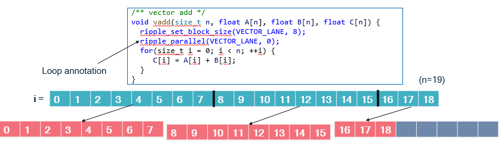

# Distributing loop computations in Ripple
Inspired by the simplicity of the OpenMP(R) programming model,
we introduced a couple functions in the Ripple API to achieve similar
ways of expressing loop parallelism.

The main idea of loop-based parallelism applies to loop computations,
in the case when the iterations of a given loop are considered
independent from each other.
In this case, they can be executed in parallel, by assigning each iteration
to a parallel processing element.

The following Figure represents values of an "i" loop (in blue)
being distributed onto blocks of size 8 (in orange),
in a function that performs an element-wise addition.
We illustrate the distribution for n = 19. `VECTOR_PE` is zero.



In the `vadd` function, we can see two calls to the ripple API:
- `ripple_set_block_shape(VECTOR_LANE, 8)` models the set of parallel
processing elements to run the function as a _block_ of size 8.
The `VECTOR_LANE` parameter represents that the kind of targeted
processing elements (the lanes of a fictitious vector engine here).
This notion of block is the same as the one
used in the [SPMD programming model](./spmd.md) supported by Ripple.
In fact, loop annotations are syntactic sugar that make SPMD programs more readable.
- `ripple_parallel(BS, 0)` indicates that the immediate next statement
  is a loop whose iterations should be distributed to the block `BS`.
  The mapping between values of `i` and block index is cyclical,
  i.e., computations made for loop index `i` are mapped to block index
  `i % 8`. The 8 in the mapping is the block size
  (along the one and only dimension of the block, 0).

# Benefits compared with SPMD programming
The main advantage of loop annotations is that we can just find a
loop whose iterations are independent and which accesses data contiguously,
and declare this a parallel loop.
When the number of iterations in the parallel loop does not exactly
match the block size, `ripple_parallel` takes care of
separating the loop into a full-vector loop and an epilogue.

In the SPMD model, we need to perform that separation explicitly.

The `vadd` example provides a good means of comparison with SPMD.
The code below is the equivalent function in SPMD.
```C
void vadd(size_t n, float A[n], float B[n], float C[n]) {
  size_t i;
  ripple_block_t BS = ripple_set_block_shape(VECTOR_PE, 8);
  size_t nv = ripple_get_block_size(BS, 0);
  size_t v = ripple_id(BS, 0);
  for (i = 0; i + nv <= n; i += nv) { // Full vector loop
    C[i + v] = A[i + v] + B[i + v];
  }
  // Masked, partial vector epilogue
  if (i + v < n) {
    C[i + v] = A[i + v] + B[i + v];
  }
}
```
Since `n` is unknown, we have to take into account the case when
`n` is not a perfect multiple of the block size, 8.
When it is not, the last vector will have to load and store
only the values that are within the array bounds, i.e., less than `n`.

To do so efficiently, we first compute a loop for the cases when we know
that the full vector needs to be loaded, computed and stored.
Let's call it the _full-vector loop_.
Then, the last, partial vector needs to be computed in a so-called _epilogue_.
That last computation is controlled by the conditional `i + v < n`
to avoid out-of-bounds accesses.

The comparison between implementations is straightforward:
- The `ripple_parallel()`-based implementation is about half as long.
- It is also just as readable as the sequential implementation,
  only with two extra lines of code. The SPMD version is less readable.
- the `ripple_parallel()` version takes care of full-vector and epilogue
  separation behind the scenes.

## Full-vector cases
It may happen that the loop we want to distribute actually fits perfectly
onto the targeted block size.
In this case, computing an epilogue seems wasteful.
Use the `ripple_parallel_full()` function,
which doesn't generate the epilogue.

# Pragma form
In C and C++, calls to `ripple_parallel` are implemented
under the hood as a pragma decorating the following loop.
Here's the syntax for it:

```C
#pragma ripple parallel Block(block_shape) Dims(<dim ...>) [NoRemainder]
```

- `block_shape_variable`, a `ripple_block_t` value, i.e., the output of
`ripple_set_block_shape()` stored in a variable. You cannot pass the call to
`ripple_set_block_shape()` directly to a `Block()` construct.
The `NoRemainder` clause turns on the full-vector assumption,
in which the epilogue isn't generated.

# Block index access
The `ripple_parallel` annotation basically chunks the annotated loop
by the size of the block dimensions associated with it.
The resulting loop basically iterates over blocks,
and the original loop variable (let's call it `i`)
can be retrieved from the block loop iterator (let's call it `b`)
and the ripple index associated with the loop (let's call it `v`).
Let's assume that we have distributed our `i` loop along block dimension `1`.
`i`, `b` and `v` are related through:

`i = ripple_get_block_size(block_shape, 1) * b + ripple_id(block_shape, 1)`

The `ripple_parallel_idx()` API provides access to the block loop operator (`b`).
Hence if we distribute loop `i` along dimension `d`,
we have the identity:

`i = ripple_get_block_size(block_shape, d) * ripple_parallel_idx(block_shape, d) + ripple_id(block_shape, d)`

When `ripple_parallel` is used to distribute loop iterations over
more than one block dimension, the use of `ripple_parallel_idx` is expected
to be consistent with these dimensions.
Using `ripple_parallel_idx` outside of `ripple_parallel`-annotated loops
results in an error.

# Syntactic constraints
The syntax for loops that follow a
`ripple_parallel()` call must follow a rigid syntax.
An error is returned upon violation of these syntax rules.
- The initialization (lower bound) cannot be an expression;
it must be a constant or a variable name.
- The exit test (upper bound) must compare the loop counter using `<`
with a constant or a variable name.
- The loop counter step must be one (as in `++i` or `i++`).

For instance, the following code is unsupported
because its upper bound is _syntactically_ too complex.

```C
#define VECTOR_PE 0
void vecadd_subarray(int N, int start, int end,
                     float x[N], float y[N], float xpy[N]) {
  ripple_block_t BS = ripple_set_block_shape(VECTOR_PE, 32);
  ripple_parallel(BS, 0);
  for (int i = start; i < min(end, 129); ++i) {
    xpy[i] = x[i] + y[i];
  }
}
```
Fortunately, there is an easy workaround.
We can precompute the `min` expression into a variable,
and use that variable as the upper bound, as follows.

```C
void vecadd_subarray(int N, int start, int end,
                    float x[N], float y[N], float xpy[N]) {
  ripple_block_t BS = ripple_set_block_shape(VECTOR_PE, 32);
  size_t my_min = min(end, 129);
  ripple_parallel(BS, 0);
  for (int i = start; i < my_min; ++i) {
    xpy[i] = x[i] + y[i];
  }
}
```
While these syntactic constraints theoretically make the loop annotation
parallel programming model less generally expressive than the SPMD model,
we expect that it will still allow parallelization of
a large portion of code, if not all of it.

# General principles

At a high level, the difference between this loop annotation model
and the SPMD model is that
the annotation model introduces an automated way to distribute loop iterations.
The loop annotation model is implemented as syntactic sugar on top of the SPMD
model. Hence, all aspects of the SPMD model are maintained
in the loop annotation model, in particular:
- Computations are represented as [blocks](./spmd.md#representing-processing-elements-as-a-block).
- Multi-dimensional blocks are supported.
  To achieve this, multiple loops may be distributed onto a block.
- We can access a block element using [`ripple_id()`](./spmd.md#defining-code-as-a-function-of-the-pe-indices).
  This is similar to using `omp_get_thread_num()` in OpenMP(R) loops.
- The [shape of a computation](./spmd.md#what-determines-the-shape-of-a-value-in-a-ripple-program)
  is still determined by implicit broadcasting
  and special shape-modifying functions.
- How [conditionals affect parallel code](./spmd.md#how-conditionals-affect-simd-code).
- [Implicit scalar expansion](./spmd.md#implicit-scalar-expansion).


Each of these concepts is presented in the chapter describing
[SPMD programming with Ripple](./spmd.md).

---
OpenMP is a registered trademark of the OpenMP Architecture Review Board.

---
*Copyright (c) 2024-2025 Qualcomm Innovation Center, Inc. All rights reserved.
SPDX-License-Identifier: BSD-3-Clause-Clear*
