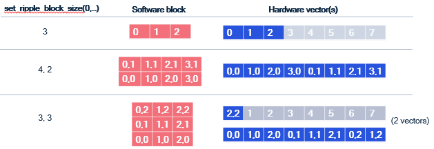

# The Single Program, Multiple Data (SPMD) programming model in Ripple

SPMD is a way to express parallel computations in programs
where repetitive work needs to be distributed
among a set of processing elements (PEs).

Since CUDA(R) and OpenCL(R) are also SPMD parallel programming abstractions,
CUDA and OpenCL developers will find Ripple familiar.
However, there are some important differences with CUDA and OpenCL,
which we stress in a the [Ripple vs. CUDA and OpenCL](./vs-cuda.md) section.

To create a parallel program using the SPMD model,
a user has to specify which PE will execute which portion of the program.
Developers use the following steps
to express the parallel execution of their program onto the
processing elements of the targeted computer.
They:
- Represent the set of processing elements as a "block"
- Define their code as a function of
  the processing element's indices in the block.
- Keep in mind that a block is a software abstraction,
  mapped by Ripple to the hardware.

In the next subsections, we illustrate how this is done
concretely in the SPMD model, using the following example,
which adds two 42-long vectors using a block of 42 elements.

```C
#define VECTOR_PE 0
void array_add(float a[42], float b[42], float sum[42]) {
  // 1) Defines a block of 42 processing elements (as a one-dimensional block)
  //    These PEs map to the vector lanes of a SIMD vector engine
  ripple_block_t BS = ripple_set_block_shape(VECTOR_PE, /* block index 0 with size */ 42);

  // 2) Retrieves a block of logical indices of this block's dimension
  //    [0 ... 41]
  size_t ripple_index = ripple_id(BS, /* block dimension */ 0);

  // Block load/store/addition by indexing arrays with a block
  sum[ripple_index] = a[ripple_index] + b[ripple_index];
}
```

## Representing processing elements as a _block_
SPMD represents the set of processing elements as a _block_,
which is an array of processing elements.
The user can choose the dimension of the block to be one,
two or more (up to ten),
depending upon their needs (we address this question in the Optimization Guide).

Each PE being represented as an element of the block,
we can now index into that block to designate any PE in the block.
In short, each PE is defined by its indices in the block.

In Ripple, we define the shape of the block for a set of processing elements
by calling
```C
ripple_block_t BS = ripple_set_block_shape(int pe, size_t ... shape);
```
where `pe_id` defines the PE
(__Implementation note__: use 0 for `pe_id`, as the supported target machine
consists of one block of SIMD processing elements),
and `shape` defines the size of the block
along dimensions 0, 1, etc.
The number of sizes passed to `ripple_set_block_shape`
determines the dimension of the block for `pe_id`.

For example, we declare a `8 x 4`-shaped block of PEs identified as `VECTOR_PE`
as follows:
```C
ripple_block_t block_shape = ripple_set_block_shape(VECTOR_PE, 8, 4);
```
And we declare a one-dimensional block of size 42 as:
```C
ripple_block_t block_shape = ripple_set_block_shape(VECTOR_PE, 42);
```

Once the block shape is defined,
the size of the block along any dimension `dimension` is provided by
```C
size_t ripple_get_block_size(ripple_block_t block_shape, size_t dimension);
```

## Defining code as a function of the PE indices
In the SPMD model,
PEs in a block are all executing the same code,
but the behavior of each PE can vary as a function of its indices in the block.

We express the index of a PE for a given dimension
using the `ripple_id(ripple_block_t block_shape, int dim)` function.

For example, in the following code excerpt,
we have a block of 26 PEs,
and each PE stores one letter of the alphabet into array `alphabet`.
```C
ripple_block_t BS = ripple_set_block_shape(0, 26);
alphabet[ripple_id(BS, 0)] = 'a' + ripple_id(BS, 0);
```

In Ripple, every part of the code that depends upon a given block index
is executed in parallel.
In one dimension, this means that all code that depends upon `ripple_id(BS, 0)`
is executed by all the elements of the one-dimensional block.

The case of multi-dimensional blocks is more subtle,
in that blocks of different dimensions can coexist in a same function.
The shape of the block executing a given statement is determined
by the dimensions of all the `ripple_id()` this statement depends upon.
That way, scalar, vector and tensor operations can coexist in the same function.
Please refer to Sections [Multi-dimensional SPMD in Ripple](#multi-dimensional-spmd-in-ripple)
below for more detail.


## Mapping software processing elements to hardware processing elements
The last part of Ripple is that the blocks are a software abstraction.
In particular, the number of PEs in a block doesn't have to match the number
of hardware PEs that will run the code.

In order to provide full control of how the hardware is utilized,
Ripple defines a fixed mapping from software PEs in blocks
to hardware PEs (e.g. vector lanes in a SIMD vector engine).

In other words, Ripple defines how the PEs in a block are laid out
in hardware vectors (and matrices).
For vector targets, the layout is
[column-major](https://en.wikipedia.org/wiki/Row-_and_column-major_order).

The following figure illustrates how various blocks (including 2-d ones)
are laid out in vectors of 8 lanes.


### Coalescing
One aspect of this mapping is very important for performance optimization:
dimension 0 is always laid out contiguously in a vector.
This is important because for vector machines,
the most efficient way to load values into a vector is
when these values are laid out contiguously in memory.
Such a load is said to be _coalesced_.
The same is true for vector stores.

To obtain coalesced loads and stores,
consecutive indices along dimension 0 must access contiguous elements of memory.
This is explained in greater detail in the 
[coalescing section](../opt-guide/vector-principles.md#coalescing)
of the optimization guide.

# Determining the shape of a value in a Ripple program
In a Ripple function, each computed value is associated with a block shape,
representing the block that computes it.
We call this the "shape" of said value.

The shape of an operation in Ripple is implicitly determined by the shape of its
operands, and `ripple_id(BS, x)` represents a one-dimensional shape,
with non-trivial dimension `x`, and all other dimensions set to 1,
as illustrated in the code below.

```C
ripple_block_t BS = ripple_set_block_shape(0, 8, 8);
size_t v0 = ripple_id(BS, 0); // shape(v0) = 8x1
size_t v1 = ripple_id(BS, 1); // shape(v1) = 1x8
size_t v_sum = v0 + v1; // shape = 8x8
```

This is what we call _implicit broadcasting_.
Additionally, some special Ripple functions explicitly define an output shape
as a function of their input shape, by adding or removing dimensions.
We explain these in the following subsections.

## Implicit broadcasting
In Ripple, block shapes flow through values (dataflow).
When values of different shapes are operands of a function/operator
(e.g., binary operators `+`, `-`, `*`, etc),
their shapes are broadcast to the largest common shape shared by both
operands before being processed.

Let's revisit our addition example to understand how the last statement works,
this time using an 8-wide block:
```c
#define VECTOR_PE 0
void vector_add_1D(unsigned pindex, float *a, float *b, float *sum) {
  ripple_block_t BS = ripple_set_block_shape(VECTOR_PE, /* block index 0 with size */ 8);
  size_t ripple_index = ripple_id(BS, /* block index */ 0);

  // What is going on here?
  sum[ripple_index] = a[ripple_index] + b[ripple_index];
}
```

The last statement uses `ripple_index`, which equals the `ripple_id()` and
means that there is block semantics being propagated, but how?

- In C/C++, array accesses such as `a[ripple_index]` are syntactic sugar for doing
pointer arithmetic, meaning is it equivalent to computing an address and
dereferencing it:
    ```c
    a[ripple_index] = *(a + ripple_index)
    ```
- `a + ripple_index` is a binary operator taking a pointer `a`
  and a 8-wide block offset `ripple_index`.
  As illustrated on the Figure below:
  - `a` is scalar; implicit broadcast dictates that it must be broadcast
  to the same shape as its other operand to `+`, an 8-wide block,
  so that the `+` can be applied element-wise to the vector elements of its
  operands and form an 8-wide block.
  
  - The pointer arithmetic addition thus results in a block of addresses.
- Finally, dereferencing `*(a + ripple_index)` means loading
  a block of addresses `a + ripple_index`,
  which gives the block of floats that were at these addresses.

The same happens with `b[ripple_index]`.
The addition can proceed because
`a[ripple_index]` has the same block shape and the store to `sum[ripple_index]`
works similarly.

If you have worked with Python's `numpy` library, which uses the same
broadcasting semantics of operands, you will feel at home with Ripple.

## Shape-modifying functions
There are three types of Ripple API functions that explicitly modify shapes
between their input and output values.
For the purpose of illustration here, let us assume an `8x8` block,
and that `one_d_x` is a `8x1` value and `two_d_x` is an `8x8` value.
- __reductions__, which perform an operation
  that combines slices of the incoming shape with each other.
  For instance:
  - `ripple_reduceadd(0b1, one_d_x)` adds all the elements of
    one-dimensional value `one_d_x` along dimension `0`.
    Its output is a scalar (i.e., a zero-dimensional value).
  - `ripple_reducemax(0b10, two_d_x)` takes the maximum of
  two-dimensional value `two_d_x` along dimension `1`
  (because bit `1` of the first argument is set but not bit `0`).
  Its output value is hence `8x1`: a one-dimensional value expressed
  in a two-dimensional space.
- __slicing__, which extracts a slice from the block along some dimensions.
  For example:
  - `ripple_slice(two_d_x, 1, -1)` takes all the elements of indices (1, *)
    from `two_d_x`. Its output value has a `1x8` shape.
  - `ripple_slice(two_d_x, 2, 3)` takes element (2, 3) from `two_d_x`.
    Its output value is scalar.
- __broadcasts__ (also often called "splats").
  Besides implicit broadcasts offered by Ripple, we can also
  explicitly broadcast a value along any set of dimensions.
  For instance, `ripple_broadcast(VECTOR_PE, 0b10, one_d_x)`
  replicates the `8x1` value `one_d_x` along dimension `1`,
  outputting it as an `8x8` value.

Please refer to the [Ripple API Specification](./api.md) for more detail on
these API functions.

# Multi-dimensional SPMD in Ripple
Part of Ripple's objective to be as efficient as possible forced
an interpretation of multi-dimensional blocks
that is different from the one known in CUDA(R) and OpenCL(R).
In Ripple, values of different dimensions can coexist in the same function.
The shape of a value is determined implicitly by the dimensions of its operands
through implicit broadcast,
or explicitly for `ripple_id` and the shape-modifying functions.

Consider for instance the following matrix multiply program,
in which a 2-dimensional block is declared, with two indices `x` and `y`.

```C
 1: matmul(float A[N][M], float B[K][N], float C[K][M]) {
 2:   ripple_block_t BS = ripple_set_block_shape(VECTOR_PE, 8, 8);
 3:   assert (N % 8 == 0);
 4:   assert (M % 8 == 0);
 5:   size_t x = ripple_id(BS, 0);
 6:   size_t y = ripple_id(BS, 1);
 7:   for (int i = 0; i < N; i+= 8) {
 8:     for (int j = 0; j < M; j+= 8) {
 9:       A[i + y][j + x] = 0;
10:       for (int k = 0; k < K; ++k) {
11:         A[i + y][j + x] += B[k][i + y] * C[k][j + x];
12:       }
13:     }
14:   }
15: }
```
__Fig.smpd-1__: An outer-product matrix multiply kernel.

Let's assume that the targeted SIMD vector engine can do
64 single-precision floating-point computations at a time,
i.e. it has 64 32-bit vector lanes.
Line 9 performs a 2-dimensional store of `0` into A.
The constant 0 does not depend upon any ripple_id,
so according to implicit broadcasting, it has dimension 0 (i.e., it's a scalar).
However, since the write to `A` is 2-dimensional,
0 gets broadcast to a 2-d block of `0`'s, which then gets stored in `A`.
In short, line 9 initializes a whole 8x8 tile of `A` to the value 0.

Let's go through the steps of what Line 11 does. The value
```C
C[k][j + x]
```
depends upon `x`, the block index along dimension 0.
Hence it loads a 1-dimensional (a row of 8x1) block of elements from `C`.
The value

```C
B[k][i + y]
```
depends upon `y`, the block index along dimension 1.
Hence it loads a 1-dimensional (column of 1x8) block of elements from `B`.

These two 1-dimensional blocks of elements meet in a multiplication:
```C
B[k][i + y] * C[k][j + x]
```
The multiplication depends upon both `x` and `y`, which means its shape is 8x8.
According to implicit broadcast rules:
- the left-hand side, which was 1x8,
  is broadcast along dimension 0 to an 8x8 shape
- the right-hand side, which was 8x1,
  is broadcast along dimension 1 to an 8x8 shape

Both sides of the multiplication now have the same shape,
hence the element-wise multiplication can happen, resulting in an 8x8 shape.
Finally, the 8x8 block resulting from the multiplication is added to
an 8x8 tile of A.

The above way of computing a matrix multiplication is called "outer product",
because it corresponds to an outer product between the vectors loaded from
`C` and `B`.

What's interesting in this example is that we see how computations on different
shapes coexist in the same function.
- the assertions and the computations of the values of `i` and `j` are done in
  scalar
- a 8x1 vector is loaded from `C`. We could imagine doing some more 8-1-shaped
  computations before the multiplication.
- a 1x8 vector is loaded from `B`.
- There are 8x8 multiplication, accumulation and stores.

As we'll see below, this way of mixing computations of different
dimensionalities is different from other SPMD languages like CUDA and OpenCL,
in which all the computations in the function would be 8x8,
i.e. they would each be done by 64 processing elements.

# How conditionals affect SIMD code
Code controlled by conditionals that depend upon block indices
are translated into _masked_ code, a vector predication
representation that represents how SIMD instructions implement conditionals
at the vector lane granularity.
This is explained in Subsection _Masking_ below.

In the subsequent subsection, we also go over a point worth noting
in the determination of shapes in Ripple:
they are __not__ dependent upon conditionals,
only upon the implicit broadcasting
rules and the special shape-modifying API (as stated above).

## Masking
Consider the following sequential example, which increments
even numbers in a vector pointed to by `x`:

```C
void increment_even(int16_t x[64]) {
  for (size_t v = 0; v < 64; ++v)
    if (v % 2 == 0)
      x[v] += 1;
}

```
We can easily write its vectorized version using Ripple as follows:

```C
1: void increment_even(int16_t x[64]) {
2:   ripple_block_t BS = set_ripple_block_shape(VECTOR_PE, 64);
3:   size_t v = ripple_id(BS, 0);
4:   if (v % 2 == 0)
5:     x[v] += 1;
6: }
```
Ripple turns this code into SIMD vector code.
To respect the original function's semantics, Ripple has to only run the
elements of the block `x[v]` for which `v % 2 == 0` is true.
This is performed by _masking_ the `x[v]` store,
i.e. applying the 64-wide block of booleans (called a _mask_)
from Line 4's condition to Line 5's block of increments.
The mask defines which elements need to be performed and which ones shouldn't.
Pairing the mask with the store in line 5 results in a _masked store_,
which is how SIMD hardware allows for the selective storing of vector elements.

In short, masking is the transformation of a condition that depends upon
one or more `ripple_id`s into a mask, which is then applied to operations
controlled by said condition.

Ripple only actually masks three necessary operations to render a correct
program:
- stores (writes)
- loads (reads)
- reductions

## How shape affects masking
To more fully specify how Ripple works,
let us illustrate how masking is applied in a more complex case,
when a condition involves more dimensions than the computation it controls.

Consider the following code:
```C
 1: void increment_even(int16_t x[8], int16_t y[8], int16_t z[8][8]) {
 2:  ripple_block_t BS = ripple_set_block_shape(VECTOR_PE, 8, 8);
 3:  size_t v0 = ripple_id(BS, 0);
 4:  size_t v1 = ripple_id(BS, 1);
 5:  if (v0 % 2 == 0) { // 8x1 condition (mask)
 6:    x[v0] += 1;      // 8x1
 7:    y[v1][v0] += 1;  // 8x8
 8:    w += 1;          // scalar, i.e. 1x1
 9:    z[v1] += 1;      // 1x8
10:  }
11:}
```
How does the `v0 % 2 == 0` condition apply to the three statements it controls,
lines 6-9?
The condition's shape is `8x1`, but the shapes of these three statements
are different from each other.

Line 6 is the case we already know:
the conditional has the same shape as the statement,
hence the `8x1` mask (i.e. block of booleans) applies element-wise
to each of the `8x1` operations in line 6.

Line 7 exposes a shape mismatch between the `8x1` condition
and the computation, which is `8x8`.
Implicit broadcast takes care of this case:
the `8x1` conditional is broadcast (i.e., replicated) along dimension 1,
and applied element-wise to the line 7 computation.

Line 8 is trickier, because the `8x1` condition shape cannot be broadcast
to Line 7's `1x1` computation.
The rule here is that the Line 8 statement should execute whenever there
exists a value of `v0` for which `v0 % 2 == 0`.
To obtain such a mask, Ripple takes the `OR` of all elements in the condition,
which makes a `1x1` mask.

Finally, line 9 combines the two previous principles for applying a mask
to a differently-shaped computation:
the Line 5 mask is first `OR`-reduced to a `1x1` mask,
and then broadcast along dimension 1, resulting in a `1x8` mask,
which can be applied to the `1x8` Line 8 computation.

# Implicit scalar expansion
Consider our `Fig. smpd-1` outer-product example, but where we want to
perform the tile matrix multiplication (i.e. line 11) using two
statements:
- one to compute the (two-dimensional) outer product
  between the one-dimensional vectors
- the other one to accumulate the outer product onto `A`.
We would then rewrite Line 11 into two lines, as such:
```C
 1: void matmul(float A[N][M], float B[K][N], float C[K][M]) {
 2:   ripple_block_t BS = ripple_set_block_shape(VECTOR_PE, 8, 8);
 3:   assert (N % 8 == 0);
 4:   assert (M % 8 == 0);
 5:   size_t x = ripple_id(BS, 0);
 6:   size_t y = ripple_id(BS, 1);
 7:   float tmp[8][8];
 8:   for (int i = 0; i < N; i+= 8) {
 9:     for (int j = 0; j < M; j+= 8) {
10:       A[i + y][j + x] = 0;
11:       for (int k = 0; k < K; ++k) {
12:         tmp[y][x] = B[k][i + y] * C[k][j + x];
13:         A[i + y][j + x] += tmp[y][x];
14:       }
15:     }
16:   }
17: }
```
__Fig. spmd-2__: Breaking down the outer product into two statements

Notice that we had to introduce a temporary variable `tmp`
to store the `8x8` value of the outer product.

Having to declare an array whenever we introduce a temporary is
far from ideal:
- Code can quickly become less readable
  if we add array accesses for each temporary variable.
- It's easier to introduce inconsistencies
  (in particular, out-of-bounds array issues)
  if we decide to change the block shape.
  In this example, we would have to modify the dimensions of `tmp` as well.
- Compilers are often less good at optimizing array code
  than scalar code.

For these reasons, Ripple allows scalar variables
to automatically adopt the shape of the value that gets assigned to them.
We call this mechanism scalar expansion, and with it,
in our example we can write the following nicer code instead:

```C
void matmul(float A[N][M], float B[K][N], float C[K][M]) {
  ripple_block_t BS = ripple_set_block_shape(VECTOR_PE, 8, 8);
  assert (N % 8 == 0);
  assert (M % 8 == 0);
  size_t x = ripple_id(BS, 0);
  size_t y = ripple_id(BS, 1);
  for (int i = 0; i < N; i+= 8) {
    for (int j = 0; j < M; j+= 8) {
      A[i + y][j + x] = 0;
      for (int k = 0; k < K; ++k) {
        float tmp = B[k][i + y] * C[k][j + x];
        A[i + y][j + x] += tmp;
      }
    }
  }
}
```
__Fig. spmd-3__: 2-statement outer product using implicit scalar expansion

where `tmp` is declared as a scalar,
and is scalar-expanded to an `8x8` value for us by Ripple.

## Store consistency
The implicit scalar expansion mechanism is only available for scalars.
Otherwise, as we have seen, shapes are determined by the implicit broadcast rule
and the shape-modifying Ripple API.

Shape consistency is the responsibility of developers.
The main example where we can write inconsistent code is when
storing a value of dimension `n` to a memory region of dimension less than `n`,
as in the following example:

```C
ripple_block_t BS = ripple_set_block_shape(VECTOR_PE, 8, 8);
size_t v0 = ripple_id(BS, 0);
size_t v1 = ripple_id(BS, 1);
float x = A[v0] + B[v1]; // shape of x  is 8x8
C[v0] = x; // storing an 8x8 value to a 8x1 memory region is illegal
```

## Keep implicit scalar expansion simple

The implicit scalar expansion mechanism is really meant for temporaries,
so we can keep writing code that looks readable because it looks scalar.
We discourage sophisticated use of these temporary scalars, such as
using the address of tmp,
as the resulting semantics, although well-defined,
become harder to follow.

Take the following vector inner product as an example.

```c
 1: int32_t inner_product(int * scratchpad, short * v1, short * v2, size_t n) {
 2:   assert(n % 64 == 0);
 3:   ripple_block_t BS = ripple_set_block_shape(VECTOR_PE, 64);
 4:   size_t v = ripple_id(BS, 0);
 5:   size_t nv = ripple_get_block_size(BS, 0);
 6:   int32_t result = 0;
 7:   for (int block = 0; block <n; block += nv) {
 8:     *scratchpad = v2[block * nv + v];
 9:     result += v1[block * nv + v] * (*scratchpad);
10:   }
11:   return ripple_reduceadd(0b1, result)
12: }
```

Here, the developer is seemingly trying to force the temporary to be
at an address defined by the `scratchpad` pointer.
The `result` variable is a scalar, hence it gets expanded inside the loop,
and it comes out of the loop as a `64`-wide 1-dimensional block.
This is no problem.

`scratchpad` is different. While `*scratchpad` represents a scalar value,
it is really a scalar (i.e., zero-dimensional) access to array `scratchpad`.
A better way to see this is to use the equivalent array notation to access
`scratchpad` in lines 8 and 9:
```c
 8:    scratchpad[0] = v2[v];
 9:    result += v1[block * nv + v] * scratchpad[0];
```
With this version, it becomes obvious that the developer tries to store
the 1-dimensional block `v2[v]` into the zero-dimensional array location
`scratchpad[0]` on line 8, resulting in a shape mismatch.
In contrast, note that the `scratchpad` access on line 9 is legal:
it is a scalar load from `scratchpad`,
which gets implicitly broadcast to fit the 1-d shape of the other multiplication.

Implicit scalar expansion is really meant as a convenience for temporary scalars.
It won't work for some other scalar cases, such as:
- global variables
- object or class variables (in C++)
- structs, unless the compiler can determine that they are really
  just a collection of temporary variables put together in a struct.

# Command-line
The SPMD form is used by default when enabling Ripple at the command line:

```bash
clang -fenable-ripple ...
```

---
CUDA is a trademark of NVIDIA Corporation.

OpenCL is a trademark of Apple Incorporated.

---
*Copyright (c) 2024-2025 Qualcomm Innovation Center, Inc. All rights reserved.
SPDX-License-Identifier: BSD-3-Clause-Clear*
